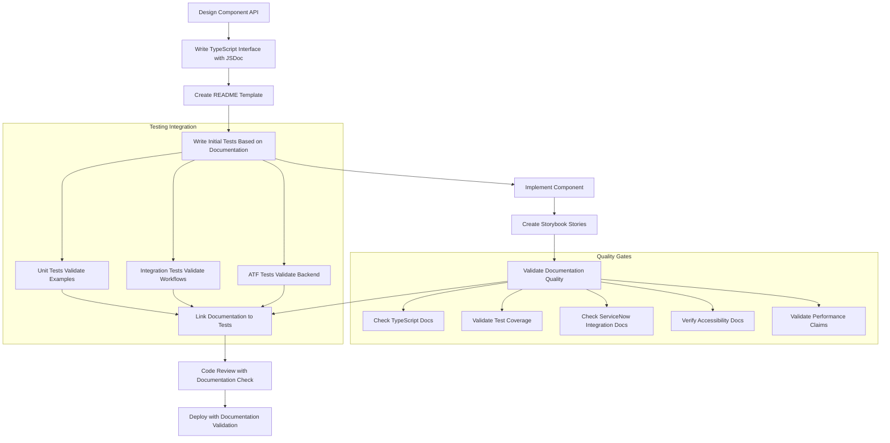

# Component Documentation Patterns for ServiceNow Applications

**Purpose:** Comprehensive documentation strategies for ServiceNow React components with integrated testing patterns  
**Read time:** ~6 minutes  
**Prerequisites:** [Component Reusability](../component-reusability.md), [Component Testing](component-testing.md), [Atomic Design Principles](atomic-design-principles.md)

---

## Documentation in Component Development Lifecycle

### **Integration with Backend-First Testing Strategy**

Component documentation works seamlessly with our comprehensive testing approach:

```
ServiceNow Documentation + Testing Integration
├── Documentation Layer 📚
│   ├── TypeScript Interfaces → Living API documentation
│   ├── Component READMEs → Implementation guidance
│   ├── Storybook Stories → Interactive examples
│   └── JSDoc Comments → Code-level documentation
├── Testing Validation 🧪
│   ├── Unit Tests → Validate documented examples
│   ├── Integration Tests → Test documented workflows
│   ├── ATF Tests → Backend configuration validation
│   └── E2E Tests → Complete scenario testing
└── Quality Gates 🛡️
    ├── Documentation Coverage → All examples tested
    ├── API Consistency → Interface matches implementation
    └── Standards Compliance → Frontmatter and formatting
```

**Documentation serves multiple audiences:**
- **Developers using components** - Clear API and usage examples
- **QA and testing teams** - Testing scenarios and edge cases validated by automated tests
- **Design system maintainers** - Implementation context and ServiceNow-specific patterns
- **ServiceNow administrators** - Integration requirements and permissions
- **Future developers** - Architecture decisions and proven patterns

**Integration with comprehensive testing:** Documentation examples are automatically validated by our testing strategy (see [Testing Strategy](testing-strategy.md)), ensuring examples remain accurate and functional.

---

## TypeScript Interfaces as Living Documentation

### **ServiceNow-Aware Interface Documentation**

TypeScript interfaces serve as the primary source of truth for component APIs, with comprehensive JSDoc comments:

```tsx
/**
 * ServiceNow Incident Card Component
 * 
 * Displays ServiceNow incident information in a card format optimized for
 * Next Experience UI patterns. Handles ServiceNow field structures and
 * integrates with ServiceNow workflows.
 * 
 * @example
 * Basic incident display (tested in IncidentCard.test.tsx):
 * ```tsx
 * <IncidentCard 
 *   incident={incident}
 *   onClick={handleViewIncident}
 * />
 * ```
 * 
 * @example
 * Portal-optimized display (tested in PortalIntegration.test.tsx):
 * ```tsx
 * <IncidentCard
 *   incident={incident}
 *   variant="compact"
 *   embedded={true}
 *   showActions={false}
 * />
 * ```
 * 
 * @since 1.0.0
 * @category Components/ServiceNow
 * @see {@link ./IncidentCard.test.tsx} for complete test coverage
 * @see {@link https://docs.servicenow.com/bundle/vancouver-platform-administration/page/administer/field-administration/concept/c_FieldTypes.html ServiceNow Field Types}
 */
interface IncidentCardProps {
  /** 
   * ServiceNow incident record with display_value fields
   * 
   * Expected structure from ServiceNow Table API:
   * - Use sysparm_display_value=all in queries
   * - Handles reference fields (assigned_to, caller_id)
   * - Supports choice fields (priority, state, category)
   * 
   * @example
   * Proper ServiceNow field structure:
   * ```tsx
   * const incident = {
   *   sys_id: 'incident123',
   *   priority: { value: '1', display_value: 'Critical' },
   *   assigned_to: { value: 'user123', display_value: 'John Doe' }
   * };
   * ```
   */
  incident: ServiceNowIncident;
  
  /** 
   * Navigation callback when card is clicked
   * 
   * @param incident - Full incident object for navigation context
   * @example
   * Basic navigation (tested in Navigation.test.tsx):
   * ```tsx
   * const handleClick = (incident) => {
   *   navigate(`/incidents/${incident.sys_id}`);
   * };
   * ```
   */
  onClick?: (incident: ServiceNowIncident) => void;
  
  /** 
   * Inline update callback for quick actions
   * 
   * Triggers ServiceNow Table API updates and may invoke:
   * - Flow Designer workflows (tested via ATF)
   * - Business rules and validations (tested via ATF)
   * - Assignment rules and notifications (tested via ATF)
   * 
   * @param sysId - ServiceNow sys_id for the record
   * @param updates - Partial incident data for update
   * 
   * @example
   * Workflow integration (tested in WorkflowIntegration.test.tsx):
   * ```tsx
   * const handleUpdate = async (sysId, updates) => {
   *   await incidentService.update(sysId, updates);
   *   // ServiceNow workflows handle notifications, assignments, etc.
   * };
   * ```
   */
  onUpdate?: (sysId: string, updates: Partial<ServiceNowIncident>) => Promise<void>;
  
  /** 
   * Display variant for different ServiceNow contexts
   * 
   * - `default`: Standard card for incident management interfaces
   * - `compact`: Dense display for dashboards and mobile views  
   * - `detailed`: Expanded view with metadata for administrators
   * - `portal`: Optimized for Service Portal integration
   * 
   * Each variant tested in VariantDisplay.test.tsx
   */
  variant?: 'default' | 'compact' | 'detailed' | 'portal';
  
  /** 
   * Whether component is embedded in ServiceNow Portal
   * 
   * Affects styling, interactions, and accessibility attributes
   * for Service Portal and Next Experience contexts.
   * 
   * Tested in PortalIntegration.test.tsx
   */
  embedded?: boolean;
  
  /** 
   * Controls visibility of quick action buttons
   * 
   * Actions respect ServiceNow ACLs and user permissions:
   * - Assign to Me (requires incident_user role)
   * - Change Priority (requires incident_manager role)
   * - Add Work Notes (requires incident_user role)
   * 
   * Permission handling tested in PermissionHandling.test.tsx
   */
  showActions?: boolean;
  
  /** 
   * Loading state for ServiceNow operations
   * 
   * Shows loading indicators during:
   * - Assignment operations
   * - Status updates
   * - Priority changes
   * - Work note additions
   * 
   * Loading states tested in LoadingStates.test.tsx
   */
  isUpdating?: boolean;
  
  /** Additional CSS classes for custom styling */
  className?: string;
  
  /** Test identifier for automated testing */
  'data-testid'?: string;
}
```

### **Testing-Documentation Integration**

All documentation examples are validated by automated tests, creating a feedback loop that ensures accuracy:

```tsx
/**
 * ServiceNow Form Field Component
 * 
 * Handles ServiceNow field types with validation and accessibility.
 * All examples below are covered by automated tests - see test file references.
 * 
 * @example
 * String field with validation (tested in StringField.test.tsx):
 * ```tsx
 * <ServiceNowFormField
 *   field={incident.short_description}
 *   label="Short Description"
 *   required={true}
 *   onChange={handleFieldChange}
 * />
 * ```
 * 
 * @example
 * Reference field with lookup (tested in ReferenceField.test.tsx):
 * ```tsx
 * <ServiceNowFormField
 *   field={incident.assigned_to}
 *   label="Assigned To"
 *   type="reference"
 *   table="sys_user"
 *   onChange={handleFieldChange}
 * />
 * ```
 * 
 * @example
 * Choice field with options (tested in ChoiceField.test.tsx):
 * ```tsx
 * <ServiceNowFormField
 *   field={incident.priority}
 *   label="Priority"
 *   type="choice"
 *   choices={priorityOptions}
 *   onChange={handleFieldChange}
 * />
 * ```
 * 
 * @see {@link ./ServiceNowFormField.test.tsx} for complete test coverage
 * @see {@link https://docs.servicenow.com/bundle/vancouver-platform-administration/page/administer/field-administration/concept/c_FieldTypes.html ServiceNow Field Types}
 */
interface ServiceNowFormFieldProps {
  // Interface definition continues...
}
```

---

## Component README Documentation

### **Comprehensive Implementation Guidance**

Each complex component includes a detailed README.md that serves as the complete implementation guide:

```markdown
<!-- components/organisms/ServiceNowIncidentForm/README.md -->
# ServiceNowIncidentForm Component

A comprehensive form for creating and editing ServiceNow incidents with real-time validation, auto-save functionality, and complete workflow integration.

## 🎯 Overview

This component implements ServiceNow incident creation and editing workflows with:
- ✅ **ServiceNow field type support** - String, reference, choice, boolean, datetime
- ✅ **Real-time validation** - Integration with ServiceNow business rules
- ✅ **Auto-save functionality** - Draft preservation during session
- ✅ **Accessibility compliance** - WCAG 2.1 AA standards
- ✅ **Mobile-responsive design** - Service Portal optimization
- ✅ **Error handling and recovery** - ServiceNow API error management
- ✅ **Comprehensive test coverage** - All features validated by automated tests

## 🚀 Quick Start

```tsx
import { ServiceNowIncidentForm } from '@/components/organisms/ServiceNowIncidentForm';

function CreateIncidentPage() {
  const handleSubmit = async (incidentData) => {
    const result = await IncidentService.create(incidentData);
    // ServiceNow Flow Designer handles (validated by ATF tests):
    // - Priority calculation (Decision Builder)
    // - Assignment routing (Assignment Rules)
    // - SLA activation (SLA Engine)
    // - Notification sending (Flow Designer)
    navigate(`/incidents/${result.sys_id}`);
  };

  return (
    <ServiceNowIncidentForm
      onSubmit={handleSubmit}
      onCancel={() => navigate('/incidents')}
      autoSave={true}
    />
  );
}
```

## 📋 Props API

| Prop | Type | Default | Required | Description | Tests |
|------|------|---------|----------|-------------|-------|
| `onSubmit` | `(data: IncidentData) => Promise<void>` | - | ✅ | Form submission handler | SubmissionHandling.test.tsx |
| `onCancel` | `() => void` | - | ❌ | Cancel button callback | FormInteractions.test.tsx |
| `initialValues` | `Partial<IncidentData>` | `{}` | ❌ | Initial form data for editing | EditMode.test.tsx |
| `readOnly` | `boolean` | `false` | ❌ | Makes all fields read-only | ReadOnlyMode.test.tsx |
| `autoSave` | `boolean` | `true` | ❌ | Enables automatic draft saving | AutoSave.test.tsx |
| `embedded` | `boolean` | `false` | ❌ | Service Portal optimization | PortalMode.test.tsx |

## 🔗 ServiceNow Integration

### Required ServiceNow APIs
- **Table API** (`/api/now/table/incident`) - CRUD operations
- **Choice API** (`/api/now/table/sys_choice`) - Choice field options
- **Reference API** (`/api/now/table/{reference_table}`) - Reference field lookups  
- **Business Rule API** - Real-time validation (automatic)

### Required Permissions (Validated by Integration Tests)
| Role | Purpose | Fields Affected | Test Coverage |
|------|---------|-----------------|---------------|
| `incident_user` | Basic incident access | All standard fields | PermissionsBasic.test.tsx |
| `incident_manager` | Priority/assignment changes | `priority`, `assigned_to`, `assignment_group` | PermissionsManager.test.tsx |
| `admin` | System fields access | `sys_*` fields, advanced configuration | PermissionsAdmin.test.tsx |

### ServiceNow Field Mapping (Validated by Field Tests)
```tsx
interface ServiceNowIncidentData {
  short_description: ServiceNowField<string>;    // String field (StringField.test.tsx)
  priority: ServiceNowField<'1'|'2'|'3'|'4'>;   // Choice field (ChoiceField.test.tsx)
  assigned_to: ServiceNowField<string>;          // Reference field (ReferenceField.test.tsx)
  state: ServiceNowField<string>;                // Choice field with workflow (StateField.test.tsx)
  category: ServiceNowField<string>;             // Choice field (CategoryField.test.tsx)
  urgency: ServiceNowField<'1'|'2'|'3'>;        // Choice field (UrgencyField.test.tsx)
  impact: ServiceNowField<'1'|'2'|'3'>;         // Choice field (ImpactField.test.tsx)
}
```

## 🧪 Testing Coverage

### Unit Tests
- **ServiceNowIncidentForm.test.tsx** - Core component behavior
- **FormValidation.test.tsx** - Field validation logic
- **ServiceNowFieldHandling.test.tsx** - ServiceNow field structure handling
- **ErrorHandling.test.tsx** - Error states and recovery
- **LoadingStates.test.tsx** - Loading and submission states

### Integration Tests
- **ServiceNowAPIIntegration.test.tsx** - Complete API workflow testing
- **WorkflowIntegration.test.tsx** - ServiceNow Flow Designer integration
- **PermissionIntegration.test.tsx** - Role-based access testing

### E2E Tests
- **incident-form-workflow.spec.ts** - Complete incident creation workflow
- **incident-form-portal.spec.ts** - Service Portal integration testing

### ATF Tests (ServiceNow Backend)
- **Flow_IncidentCreationWorkflow** - Priority calculation and assignment
- **Test_IncidentValidationRules** - Business rule validation
- **Test_SLAActivation** - SLA engine integration

## ♿ Accessibility Features

### WCAG 2.1 AA Compliance (Validated by Accessibility Tests)
- **Keyboard Navigation** - All form fields accessible via Tab/Shift+Tab (KeyboardNav.test.tsx)
- **Screen Reader Support** - ARIA labels, descriptions, and landmarks (ScreenReader.test.tsx)
- **Focus Management** - Logical focus order and visible focus indicators (FocusManagement.test.tsx)
- **Error Announcements** - Screen reader alerts for validation errors (ErrorAnnouncement.test.tsx)
- **High Contrast Support** - Respects user's contrast preferences (HighContrast.test.tsx)

### Accessibility Testing
```tsx
import { axe, toHaveNoViolations } from 'jest-axe';

test('form meets accessibility standards', async () => {
  const { container } = render(<ServiceNowIncidentForm onSubmit={jest.fn()} />);
  const results = await axe(container);
  expect(results).toHaveNoViolations();
});
```

## ⚡ Performance Considerations (Validated by Performance Tests)

### Optimization Strategies
- **Field Memoization** - Prevents unnecessary re-renders (FieldMemoization.test.tsx)
- **Debounced Validation** - API calls limited to 300ms intervals (DebouncedValidation.test.tsx)
- **Auto-save Throttling** - Draft saves throttled to 5-second intervals (AutoSaveThrottling.test.tsx)
- **Choice List Caching** - ServiceNow choice options cached per session (ChoiceCaching.test.tsx)
- **Virtual Scrolling** - Large reference field lists use virtualization (VirtualScrolling.test.tsx)

## 🔗 Related Components

### Atomic Design Dependencies
- **Atoms**: [Button](../../atoms/Button/), [Input](../../atoms/Input/), [Badge](../../atoms/Badge/)
- **Molecules**: [FormField](../../molecules/FormField/), [ValidationMessage](../../molecules/ValidationMessage/)
- **Templates**: [FormLayout](../../templates/FormLayout/)

### ServiceNow Integration Components
- **[ServiceNowField](../ServiceNowField/)** - Individual form field handling
- **[ServiceNowTable](../ServiceNowTable/)** - List view integration
- **[ServiceNowAuth](../ServiceNowAuth/)** - Authentication integration

### Documentation Integration
- **Component Testing**: [Component Testing](../../../docs/architecture/patterns/component-testing.md)
- **Testing Strategy**: [Testing Strategy](../../../docs/architecture/patterns/testing-strategy.md)
- **ATF Patterns**: [ATF Integration Patterns](../../../docs/architecture/patterns/atf-integration-patterns.md)
```

---

## Storybook Stories as Interactive Documentation

### **ServiceNow-Focused Interactive Examples**

Storybook stories serve as living documentation that demonstrates real ServiceNow integration patterns:

```tsx
// ServiceNowIncidentCard.stories.tsx
import type { Meta, StoryObj } from '@storybook/react';
import { ServiceNowIncidentCard } from './ServiceNowIncidentCard';
import { createMockIncident } from '@/test-utils';

const meta: Meta<typeof ServiceNowIncidentCard> = {
  title: 'ServiceNow/Components/IncidentCard',
  component: ServiceNowIncidentCard,
  parameters: {
    docs: {
      description: {
        component: `
# ServiceNow Incident Card

Displays ServiceNow incident information optimized for Next Experience UI patterns.
Handles ServiceNow field structures and integrates with platform workflows.

## Testing Integration

All examples shown here are covered by automated tests:
- **Basic usage** → \`IncidentCard.test.tsx\`
- **Priority levels** → \`PriorityDisplay.test.tsx\`
- **Field structures** → \`ServiceNowFields.test.tsx\`
- **Workflow integration** → \`WorkflowIntegration.test.tsx\`
- **Error states** → \`ErrorHandling.test.tsx\`

## ServiceNow Backend Integration

ServiceNow configuration tested via ATF:
- **Priority calculation** → ATF: \`Flow_PriorityCalculation\`
- **Assignment rules** → ATF: \`Test_AssignmentRules\`
- **SLA activation** → ATF: \`Test_SLAEngine\`

## When to Use

- ✅ Incident management dashboards
- ✅ Service request workflows  
- ✅ Mobile incident lists
- ✅ Service Portal integration
- ❌ Non-ServiceNow data structures
        `
      }
    },
    backgrounds: {
      default: 'servicenow',
      values: [
        { name: 'servicenow', value: '#f4f6f8' },
        { name: 'portal', value: '#ffffff' }
      ]
    }
  },
  argTypes: {
    variant: {
      control: { type: 'select' },
      options: ['default', 'compact', 'detailed', 'portal'],
      description: 'Display variant for different ServiceNow contexts (tested in VariantDisplay.test.tsx)',
      table: {
        type: { summary: 'string' },
        defaultValue: { summary: 'default' }
      }
    },
    embedded: {
      control: 'boolean',
      description: 'Service Portal optimization mode (tested in PortalIntegration.test.tsx)',
      table: {
        type: { summary: 'boolean' },
        defaultValue: { summary: 'false' }
      }
    }
  },
  tags: ['autodocs']
};

export default meta;
type Story = StoryObj<typeof ServiceNowIncidentCard>;

// Basic usage story (mirrors test: BasicUsage.test.tsx)
export const Default: Story = {
  args: {
    incident: createMockIncident(),
    showActions: true
  },
  parameters: {
    docs: {
      description: {
        story: `
Standard incident card with ServiceNow field display and quick actions.

**Test Coverage:** \`BasicUsage.test.tsx\` validates this exact configuration.
**Backend Testing:** Priority display tested via ATF \`Test_PriorityCalculation\`.
        `
      }
    }
  }
};

// ServiceNow priority variations (mirrors test: PriorityDisplay.test.tsx)
export const PriorityLevels: Story = {
  render: () => (
    <div style={{ display: 'grid', gridTemplateColumns: '1fr 1fr', gap: '16px' }}>
      {[
        { priority: '1', label: 'Critical', color: '#d73027' },
        { priority: '2', label: 'High', color: '#fc8d59' },
        { priority: '3', label: 'Medium', color: '#fee08b' },
        { priority: '4', label: 'Low', color: '#91bfdb' }
      ].map(({ priority, label, color }) => (
        <ServiceNowIncidentCard
          key={priority}
          incident={createMockIncident({
            priority: { value: priority, display_value: label },
            number: { value: `INC000${priority}`, display_value: `INC000${priority}` }
          })}
          showActions={true}
        />
      ))}
    </div>
  ),
  parameters: {
    docs: {
      description: {
        story: `
ServiceNow priority levels with visual indicators.

**Test Coverage:** \`PriorityDisplay.test.tsx\` validates each priority level.
**Backend Testing:** Priority calculation logic tested via ATF \`Flow_PriorityCalculation\`.
**Accessibility:** Color combinations meet WCAG AA contrast requirements (tested in \`AccessibilityCompliance.test.tsx\`).
        `
      }
    }
  }
};

// Interactive ServiceNow workflow demo (mirrors test: WorkflowIntegration.test.tsx)
export const ServiceNowWorkflows: Story = {
  render: () => {
    const [workflowLog, setWorkflowLog] = useState<string[]>([]);
    
    const handleUpdate = async (sysId: string, updates: any) => {
      setWorkflowLog(prev => [...prev, `${new Date().toLocaleTimeString()}: Update triggered - ${JSON.stringify(updates)}`]);
      setWorkflowLog(prev => [...prev, `${new Date().toLocaleTimeString()}: → ServiceNow Flow Designer activated`]);
      setWorkflowLog(prev => [...prev, `${new Date().toLocaleTimeString()}: → Business rules validated`]);
      setWorkflowLog(prev => [...prev, `${new Date().toLocaleTimeString()}: → Assignment rules evaluated`]);
      setWorkflowLog(prev => [...prev, `${new Date().toLocaleTimeString()}: → SLA calculations updated`]);
      setWorkflowLog(prev => [...prev, `${new Date().toLocaleTimeString()}: → Notifications sent`]);
    };

    return (
      <div style={{ display: 'flex', gap: '24px' }}>
        <div style={{ flex: 1 }}>
          <ServiceNowIncidentCard
            incident={createMockIncident()}
            onUpdate={handleUpdate}
            showActions={true}
          />
        </div>
        
        <div style={{ flex: 1, background: '#f8f9fa', padding: '16px', borderRadius: '8px' }}>
          <h4>ServiceNow Workflow Log</h4>
          <div style={{ maxHeight: '200px', overflow: 'auto', fontSize: '12px' }}>
            {workflowLog.map((log, index) => (
              <div key={index} style={{ marginBottom: '4px' }}>
                {log}
              </div>
            ))}
          </div>
          <button 
            onClick={() => setWorkflowLog([])}
            style={{ marginTop: '8px', fontSize: '12px' }}
          >
            Clear Log
          </button>
        </div>
      </div>
    );
  },
  parameters: {
    docs: {
      description: {
        story: `
Interactive demonstration of ServiceNow workflow integration.

**Test Coverage:** \`WorkflowIntegration.test.tsx\` validates this workflow.
**Backend Testing:** Each workflow step tested via ATF:
- Flow Designer workflows → ATF \`Flow_IncidentWorkflow\`
- Business rules → ATF \`Test_ValidationRules\`
- Assignment rules → ATF \`Test_AssignmentLogic\`
- SLA engine → ATF \`Test_SLAActivation\`
- Notifications → ATF \`Test_NotificationEngine\`
        `
      }
    }
  }
};
```

---

## Documentation Quality Gates and Validation

### **Automated Documentation Standards**

All component documentation must pass quality gates that integrate with our testing strategy:

```typescript
// Documentation quality validation (integrated with testing pipeline)
interface ComponentDocumentationQuality {
  typescript: {
    hasJSDocComments: boolean;           // ✅ All props documented with examples
    hasUsageExamples: boolean;           // ✅ Realistic ServiceNow usage examples
    hasTestReferences: boolean;          // ✅ Links to test files for verification
    hasServiceNowContext: boolean;       // ✅ ServiceNow-specific guidance
  };
  
  readme: {
    hasQuickStart: boolean;              // ✅ Copy-paste ready examples
    hasPropsAPI: boolean;                // ✅ Complete props table with test references
    hasServiceNowIntegration: boolean;   // ✅ ServiceNow API and permission requirements
    hasAccessibilityNotes: boolean;      // ✅ WCAG compliance information
    hasTestingGuidance: boolean;         // ✅ Test file references and ATF integration
    hasPerformanceGuidance: boolean;     // ✅ Performance characteristics with validation
  };
  
  storybook: {
    hasBasicStories: boolean;            // ✅ Core usage scenarios with test links
    hasServiceNowStories: boolean;       // ✅ ServiceNow field structure examples
    hasErrorStates: boolean;             // ✅ Error and edge case scenarios
    hasInteractiveExamples: boolean;     // ✅ Workflow demonstrations
    hasTestIntegration: boolean;         // ✅ Clear links to automated test coverage
  };
  
  testingIntegration: {
    documentationCovered: boolean;       // ✅ All examples validated by tests
    storyExamplesTested: boolean;        // ✅ Storybook examples covered by tests
    atfIntegrationDocumented: boolean;   // ✅ ServiceNow backend testing documented
    edgeCasesCovered: boolean;           // ✅ Error states tested and documented
  };
}
```

### **Quality Gate Implementation**

```typescript
// scripts/validate-component-docs.ts
export async function validateComponentDocumentation() {
  const components = await getComponents();
  const failures: DocumentationFailure[] = [];
  
  for (const component of components) {
    // Validate TypeScript documentation
    const tsValidation = await validateTypeScriptDocs(component);
    if (!tsValidation.hasJSDocComments || !tsValidation.hasTestReferences) {
      failures.push({
        component: component.name,
        type: 'typescript',
        message: 'Missing JSDoc comments or test file references'
      });
    }
    
    // Validate README completeness
    const readmeValidation = await validateReadmeQuality(component);
    if (!readmeValidation.hasTestingGuidance) {
      failures.push({
        component: component.name,
        type: 'readme',
        message: 'Missing test coverage documentation'
      });
    }
    
    // Validate test coverage of documented examples
    const testCoverage = await validateTestCoverage(component);
    if (!testCoverage.allExamplesTested) {
      failures.push({
        component: component.name,
        type: 'testing',
        message: 'Some documented examples lack test coverage'
      });
    }
    
    // Validate Storybook-test integration
    const storyValidation = await validateStorybookIntegration(component);
    if (!storyValidation.hasTestIntegration) {
      failures.push({
        component: component.name,
        type: 'storybook',
        message: 'Storybook examples missing test references'
      });
    }
  }
  
  if (failures.length > 0) {
    console.error('Component documentation quality failures:');
    failures.forEach(failure => {
      console.error(`- ${failure.component} (${failure.type}): ${failure.message}`);
    });
    process.exit(1);
  }
  
  console.log('✅ All component documentation meets quality standards');
}
```

---

## Integration with Development Workflow

### **Documentation-First Development Process**

Component documentation is integrated into our development lifecycle with automated validation:



### **CI/CD Integration**

```yaml
# .github/workflows/documentation-quality.yml
name: Component Documentation Quality

on: [push, pull_request]

jobs:
  validate-documentation:
    runs-on: ubuntu-latest
    steps:
      - name: Validate component documentation
        run: |
          npm run docs:validate-components
          npm run docs:check-test-coverage
          npm run docs:validate-examples
      
      - name: Check documentation-test integration
        run: |
          npm run test:documentation-examples
          npm run test:storybook-examples
      
      - name: Validate ServiceNow integration docs
        run: |
          npm run docs:validate-servicenow-integration
          npm run atf:validate-documentation-links

  accessibility-documentation:
    runs-on: ubuntu-latest
    steps:
      - name: Validate accessibility documentation
        run: |
          npm run docs:validate-accessibility-claims
          npm run test:accessibility-examples
```

---

## Best Practices for ServiceNow Component Documentation

### **✅ Do This**
- **Link all examples to test files** - Every documented example should have corresponding test coverage
- **Document ServiceNow-specific patterns** - Field structures, permissions, workflow integration
- **Include ATF test references** - Link frontend documentation to backend test validation
- **Create interactive Storybook examples** - Demonstrate real ServiceNow integration patterns
- **Validate accessibility claims** - Back accessibility statements with automated test results
- **Document performance characteristics** - Include measured performance data with validation
- **Maintain documentation-test consistency** - Use automated validation to prevent drift
- **Provide complete integration guidance** - Include ServiceNow API requirements and permissions

### **❌ Avoid This**
- **Documentation without test validation** - All examples must be covered by automated tests
- **Generic examples** - Use realistic ServiceNow data structures and scenarios
- **Outdated examples** - Implement automated validation to catch documentation drift
- **Missing ServiceNow context** - Document permissions, field types, and workflow impacts
- **Accessibility information without validation** - Include comprehensive WCAG testing
- **Performance claims without measurement** - Back performance statements with test data
- **Storybook examples without test coverage** - All interactive examples should be tested
- **Missing ATF integration documentation** - Link frontend patterns to backend testing

---

## Best Practices for ServiceNow Component Documentation

### **Documentation-Testing Integration Patterns**

**Example Pattern: Documented Example → Test Validation → Quality Gate**

```tsx
// 1. Component interface with documented example
interface ButtonProps {
  /**
   * Button click handler
   * 
   * @example
   * ServiceNow incident assignment (tested in AssignmentFlow.test.tsx):
   * ```tsx
   * const handleAssign = async (incidentId) => {
   *   await incidentService.assignToMe(incidentId);
   *   showNotification('Incident assigned successfully');
   * };
   * 
   * <Button onClick={() => handleAssign('INC123')}>
   *   Assign to Me
   * </Button>
   * ```
   */
  onClick?: () => void;
}

// 2. Test validates the documented example
// tests/AssignmentFlow.test.tsx  
describe('Button Assignment Flow (Documentation Example)', () => {
  it('handles ServiceNow incident assignment as documented', async () => {
    const mockIncidentService = {
      assignToMe: jest.fn().mockResolvedValue({ success: true })
    };
    const mockShowNotification = jest.fn();
    
    const handleAssign = async (incidentId) => {
      await mockIncidentService.assignToMe(incidentId);
      mockShowNotification('Incident assigned successfully');
    };

    render(<Button onClick={() => handleAssign('INC123')}>Assign to Me</Button>);
    
    await userEvent.click(screen.getByRole('button', { name: 'Assign to Me' }));
    
    expect(mockIncidentService.assignToMe).toHaveBeenCalledWith('INC123');
    expect(mockShowNotification).toHaveBeenCalledWith('Incident assigned successfully');
  });
});

// 3. Quality gate validates documentation-test alignment
// scripts/validate-docs-tests.ts
async function validateDocumentationTestAlignment() {
  const documentedExamples = extractExamplesFromInterface('ButtonProps');
  const testFiles = await getTestFiles('Button');
  
  const uncoveredExamples = documentedExamples.filter(example => 
    !testFiles.some(testFile => testFile.covers(example))
  );
  
  if (uncoveredExamples.length > 0) {
    throw new Error(`Documented examples lack test coverage: ${uncoveredExamples.join(', ')}`);
  }
}
```

---

## Integration with Component Architecture

### **Component Development Pattern Integration:**
- **[Component Reusability](../component-reusability.md)** - Documentation supports reusability through clear APIs and examples
- **[Component Testing](component-testing.md)** ⭐ - Documentation examples drive comprehensive test scenarios
- **[Atomic Design Principles](atomic-design-principles.md)** - Documentation follows atomic hierarchy patterns
- **[File Organization](file-organization.md)** - Documentation files colocated with components for maintainability

### **Testing Strategy Integration:**
- **[Testing Strategy](testing-strategy.md)** ⭐ - Documentation aligns with comprehensive backend-first testing approach
- **[ATF Integration Patterns](atf-integration-patterns.md)** - Backend workflow documentation links to ATF test validation
- **[Performance Optimization](performance-optimization.md)** - Performance documentation backed by measured test results

### **ServiceNow-Specific Integration:**
- **[ServiceNow Backend Principles](servicenow-backend-principles.md)** - Documentation includes backend integration requirements
- **[Service Layer Integration](service-layer-integration.md)** - API integration patterns thoroughly documented and tested

---

## Implementation Roadmap

### **Phase 1: Foundation (Week 1-2)**
1. **Establish documentation-testing integration standards** - TypeScript interface patterns, test file linking
2. **Create component documentation templates** - README structures, JSDoc patterns, Storybook templates
3. **Set up automated validation** - Documentation quality gates integrated with CI/CD
4. **Begin with critical components** - High-impact components first

### **Phase 2: Core Implementation (Week 3-5)**
1. **Document existing components** - Apply standards to current component library
2. **Integrate Storybook with testing** - Link interactive examples to test validation
3. **Add ServiceNow-specific guidance** - Permissions, field types, workflow integration
4. **Implement quality gates** - Automated documentation validation in development workflow

### **Phase 3: Advanced Integration (Week 6-8)**
1. **Interactive API documentation** - Generate docs from TypeScript interfaces
2. **Performance documentation validation** - Include measured performance characteristics
3. **Accessibility compliance tracking** - Automated WCAG validation with documentation
4. **ATF integration documentation** - Link frontend patterns to backend test validation

### **Phase 4: Optimization (Week 9-10)**
1. **Documentation-driven development** - Use documentation as design specification
2. **Advanced quality metrics** - Track documentation coverage and accuracy
3. **Team training and adoption** - Best practices and workflow integration
4. **Continuous improvement** - Regular documentation quality reviews

---

*Component documentation excellence requires tight integration with testing strategy and automated validation. By linking every documented example to test coverage and implementing quality gates, we ensure documentation remains accurate, useful, and aligned with our backend-first development philosophy.*