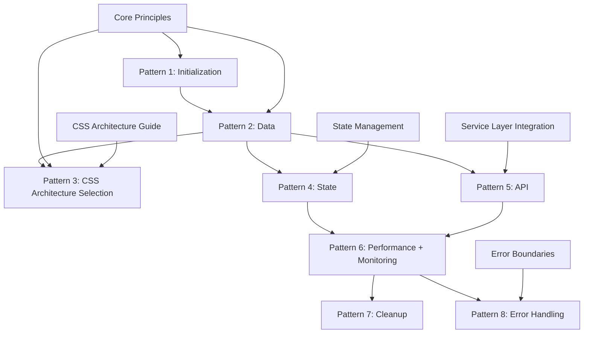

# ServiceNow React Essential Patterns

**Purpose:** Complete production-ready patterns for ServiceNow React applications with validated CSS architecture options and enhanced performance optimization  
**Read time:** ~10 minutes  
**Prerequisites:** [Core Principles](core-principles.md) • [Service Layer Integration](patterns/service-layer-integration.md) • [CSS Architecture](styling-practices.md)

> **✅ PRODUCTION-TESTED:** All patterns have been successfully deployed and tested in live ServiceNow environments with thousands of records. CSS approaches validated with comprehensive performance analysis.

---

## 🏗️ **Three-Tier Architecture Foundation**

This pattern guide is part of a strategic three-tier documentation architecture:

### **📋 Foundation** → [Core Development Principles](core-principles.md) *(8 min)*
**"WHY we build this way"** - Architectural foundation, ServiceNow constraints, technology decisions
- Development philosophy (Configuration-first backend + Code-first frontend)
- ServiceNow platform constraints and build limitations  
- Technology stack decisions and ServiceNow compatibility
- Hybrid development approach rationale

### **🎯 Implementation** → **ServiceNow React Essential Patterns** *(This Document)*
**"WHAT patterns to implement"** - Complete pattern library and implementation reference
- 8 essential patterns with complete code examples
- Three validated CSS architecture approaches
- Performance monitoring integration
- ServiceNow-specific architectural guidance

### **⚡ Execution** → [Quick Implementation Guide](quick-implementation-guide.md) *(5 min)*
**"HOW to build features fast"** - Time-boxed development workflow  
- 25-minute development workflow applying these patterns
- Step-by-step implementation with atomic design
- ServiceNow SDK tool awareness and constraints

---

## 🚨 CRITICAL: Build Agent Implementation Directives

### **💯 Conservative Development Process**

**PATTERN:** Apply changes in small, atomic, reversible increments during development. Be ambitious with functionality, conservative with implementation approach.

**PACKAGE MANAGEMENT:** Always add packages with '^version' where version is the latest stable build to ensure maximum compatibility and feature access.

**IMPORT USING RELATIVE PATH:** Don't use '@/api/' imports for components, utilies, hooks etc. Configure correct relative imports to succesfully run a build.

**CDN RESOURCE VALIDATION:** When using external resources from a CDN (like stylesheets), ALWAYS show the resources used in debug version (debug implemented using URL parameter sn_debug=true) and ask the user to VALIDATE by clicking the resource. This is CRITICAL to prevent styling problems with incorrect resources.

**DEBUG SWITCH:** NEVER use NODE_ENV as this is not set on ServiceNow. We ALWAYS have to use a URL paramter based debug setup. NEVER use ?DEBUG=true or ?debug=true, this conflicts with standard ServiceNow parameters. We use ?sn_debug=true, stick to that.


```typescript
// IMPLEMENTATION DIRECTIVE: All changes must follow this process
interface BuildAgentDirective {
  // CORE PRINCIPLES
  incrementalDevelopment: {
    approach: "small-atomic-changes";           // Each change is minimal and focused
    reversibility: "always-possible";          // Must be easy to revert any change
    functionality: "ambitious-but-tested";     // Don't limit features, limit risk
    imports: "relative-only";                  // Only use relative path import statements
  };
  
  // MANDATORY WORKFLOW
  changeProcess: {
    step01: "explicit-get-approval";            // All changes EXPLICITELY need approval first
    step02: "implement-atomically";             // Make one focused and atomic change
    step03: "run-diagnostics";                  // validate the source
    step04: "focus-single-issue";               // IF received list of typescript errors: FIRST focus on the top 1 or top 2 when related
    step05: "explain-changes-and-reasoning";    // Tell the user what was changed and why
    step06: "confirm-build";                    // Ask user approval before starting build or do another focused and atomic change
      step06_Option1: "another-atomic-change";  // user agreed to another change, restart workflow from step01
      step06_Option2: "build-confirmed";        // user agreed move to build, continue
    step07: "validate-build";                   // npm run build must succeed
    step08: "validate-deployment";              // Deploy to test environment
    step09: "user-review";                      // User acceptance required by in-browser review
    step10: "proceed-or-rollback";              // Continue or revert based on results
  };
  
  // VALIDATION GATES
  qualityGates: {
    buildValidation: "zero-errors";            // Build must complete without errors
    typeValidation: "strict-typescript";       // All types must be correct
    patternCompliance: "follow-guide";        // Must follow Advice.md
    testability: "user-testable";             // Changes must be user-verified by in-browser review
    rollbackPlan: "always-defined";           // Clear rollback path required
  };

  // CDN RESOURCE VALIDATION (CRITICAL)
  cdnValidation: {
    debugMode: "sn_debug=true";                // URL parameter to enable resource debugging
    showResources: "always-in-debug";         // Display all CDN resources when debugging
    userValidation: "click-to-validate";      // User must click each resource to validate
    preventStylingIssues: "mandatory-check";  // Prevent styling problems with validation
    failureHandling: "immediate-notification"; // Show errors immediately if resource fails
  };
}
```

### **🛡️ Implementation Safety Rules:**
- ✅ **DO:** Follow the [Core Development Principles](core-principles.md) for architectural foundation
- ✅ **DO:** Choose CSS approach using [CSS Architecture Guide](styling-practices.md)
- ✅ **DO:** Make one focused change per increment
- ✅ **DO:** Validate build + deployment + user review for each change
- ✅ **DO:** Always have a clear rollback strategy
- ✅ **DO:** Follow the essential patterns in this guide
- ❌ **DON'T:** Make multiple unrelated changes together
- ❌ **DON'T:** Skip validation steps to save time
- ❌ **DON'T:** Assume changes work without user verification

---

## 🎯 Architecture Overview

This guide provides **eight essential patterns** for building high-performance ServiceNow React applications:

### **Pattern Selection Decision Tree:**
```
Building a ServiceNow React Application?
├── Pattern 1: Initialize properly → [Initialization & Timing](patterns/servicenow-react/01-initialization-timing.md)
│   └── Solves race conditions with ServiceNow globals
├── Pattern 2: Get data efficiently → [Hybrid Data Patterns](patterns/servicenow-react/02-hybrid-data-patterns.md)
│   ├── Immediate data → Jelly template injection
│   ├── Complex calculations → G:evaluate processing
│   └── Dynamic data → Client-side API calls
├── Pattern 3: Style with validated approach → [CSS Implementation](patterns/servicenow-react/03-css-implementation.md)
│   ├── Bundle size critical → Plain CSS component classes
│   ├── Development speed critical → Chakra UI (CSS-in-JS)
│   └── Utility-first workflow → Tailwind CSS via CDN
├── Pattern 4: Manage state → [State Management](patterns/servicenow-react/04-state-management.md)
│   └── Zustand with performance optimizations (see: [State Management](patterns/state-management.md))
├── Pattern 5: Handle APIs → [API Integration](patterns/servicenow-react/05-api-integration.md)
│   └── TanStack Query with ServiceNow-specific caching (see: [Service Layer Integration](patterns/service-layer-integration.md))
├── Pattern 6: Optimize performance → [Performance Optimization](patterns/servicenow-react/06-performance-optimization.md)
│   └── React.memo, useMemo, useCallback, debouncing + monitoring
├── Pattern 7: Prevent memory leaks → [Cleanup & Memory Management](patterns/servicenow-react/07-cleanup-memory.md)
│   └── AbortController, effect cleanup, cache management
└── Pattern 8: Handle errors gracefully → [Enhanced Error Handling](patterns/servicenow-react/08-error-handling.md)
    └── Multi-level error boundaries with recovery (see: [Error Boundaries](patterns/error-boundaries.md))
```

---

## 📋 Essential Pattern Maturity

### **🔴 Critical (Must Have - Application Won't Work Without These):**

#### **[Pattern 1: ServiceNow Initialization & Timing](patterns/servicenow-react/01-initialization-timing.md)**
- **Problem:** Race conditions between ServiceNow globals and React initialization
- **Solution:** ServiceNow-aware initialization with proper timing controls
- **Impact:** ⚠️ **CRITICAL** - App fails to load without this
- **Implementation Time:** 30 minutes
- **Foundation:** Built on [Core Principles](core-principles.md) ServiceNow constraints

#### **[Pattern 2: Hybrid Data Patterns](patterns/servicenow-react/02-hybrid-data-patterns.md)**
- **Problem:** Need different data loading strategies for optimal performance
- **Solution:** Three-pattern approach (immediate, enhanced, dynamic)
- **Impact:** 🚀 **HIGH** - Major UX and performance improvements
- **Implementation Time:** 2-3 hours
- **Foundation:** Implements [Service Layer Integration](patterns/service-layer-integration.md) principles

---

### **🟡 Important (Should Have - Production Quality Features):**

#### **[Pattern 3: CSS Implementation](patterns/servicenow-react/03-css-implementation.md)** - UPDATED
- **Problem:** CSS approach selection and ServiceNow compatibility
- **Solution:** Three validated approaches - Plain CSS, Chakra UI (CSS-in-JS), or Tailwind CDN  
- **Impact:** 🎨 **HIGH** - Major development velocity and consistency differences
- **Implementation Time:** 1-3 hours (varies by approach)
- **Foundation:** Follows [CSS Architecture Guide](styling-practices.md) validated approach

**NEW: CSS Approach Decision Framework:**
```typescript
// Choose based on project priorities:
interface CSSDecisionMatrix {
  bundleSizeCritical: "Plain CSS (~0KB additional)";
  developmentSpeed: "Chakra UI (~3-5 min per component)";
  utilityWorkflow: "Tailwind CDN (~10 min per component)";
  accessibility: "Chakra UI (built-in ARIA support)";
  teamExpertise: "Plain CSS (leverage existing CSS skills)";
}
```

#### **[Pattern 4: State Management](patterns/servicenow-react/04-state-management.md)**
- **Problem:** Complex state with performance and pagination needs
- **Solution:** Zustand with hybrid data optimization
- **Impact:** ⚡ **MEDIUM** - Scalable state architecture
- **Implementation Time:** 2 hours
- **Foundation:** Implements [State Management](patterns/state-management.md) strategies

#### **[Pattern 5: API Integration](patterns/servicenow-react/05-api-integration.md)**
- **Problem:** Inefficient API calls and caching
- **Solution:** TanStack Query with ServiceNow-specific optimizations
- **Impact:** 🌐 **HIGH** - Essential for data-driven apps
- **Implementation Time:** 2-3 hours
- **Foundation:** Mandatory implementation of [Service Layer Integration](patterns/service-layer-integration.md)

---

### **🟢 Enhanced (Nice to Have - Production Polish):**

#### **[Pattern 6: Performance Optimization](patterns/servicenow-react/06-performance-optimization.md)**
- **Problem:** Unnecessary re-renders and slow interactions
- **Solution:** React.memo, useMemo, useCallback, debouncing + monitoring
- **Impact:** ⚡ **HIGH** - Smooth user experience at scale
- **Implementation Time:** 3-4 hours
- **Foundation:** Extends [Performance Optimization](patterns/performance-optimization.md) patterns

#### **[Pattern 7: Cleanup & Memory Management](patterns/servicenow-react/07-cleanup-memory.md)**
- **Problem:** Memory leaks and resource management
- **Solution:** Comprehensive cleanup patterns
- **Impact:** 🛡️ **HIGH** - Production stability
- **Implementation Time:** 2-3 hours

#### **[Pattern 8: Enhanced Error Handling](patterns/servicenow-react/08-error-handling.md)**
- **Problem:** Poor error recovery and user experience
- **Solution:** Multi-level error boundaries with notifications
- **Impact:** 🚨 **MEDIUM** - Professional error handling
- **Implementation Time:** 2-3 hours
- **Foundation:** Implements [Error Boundaries](patterns/error-boundaries.md) strategies

---

## 🚀 Quick Implementation Reference

Need to implement these patterns quickly? Use the tactical workflow:

**⚡ [Quick Implementation Guide](quick-implementation-guide.md)** *(5 minutes)*

This guide provides:
- 25-minute development workflow applying these patterns
- Step-by-step code examples with ServiceNow SDK awareness
- Success checklists and validation steps
- ServiceNow-specific constraints and solutions

### **Phase 1: Foundation (Required)**
```typescript
// 1. Initialize ServiceNow-aware React app
// See: Pattern 1 - Initialization & Timing
// Foundation: Core Principles ServiceNow constraints
const initApp = () => {
  if (isServiceNowReady()) {
    ReactDOM.createRoot(document.getElementById('root')).render(<App />);
  }
};

// 2. Set up hybrid data patterns
// See: Pattern 2 - Hybrid Data Patterns  
// Foundation: Service Layer Integration MANDATORY
window.snUserContext = { userName: "${gs.getUserName()}" }; // Immediate
window.enhancedData = { analytics: {...} };                 // Enhanced
const { data } = useQuery(['incidents'], fetchIncidents);   // Dynamic
```

### **Phase 2: Core Features (Recommended)**
```typescript
// 3. Choose and implement CSS architecture - UPDATED
// See: Pattern 3 - CSS Implementation
// Foundation: CSS Architecture Guide decision framework

// Option A: Plain CSS (bundle size critical)
import './styles/globals.css';           // First
import './styles/components.css';        // Second

// Option B: Chakra UI (development speed critical)  
import { ChakraProvider } from '@chakra-ui/react';
// Runtime CSS-in-JS, fastest development, built-in accessibility

// Option C: Tailwind CDN (utility-first workflow)
useEffect(() => {
  const link = document.createElement('link');
  link.href = 'https://cdn.jsdelivr.net/npm/tailwindcss@3.4.1/tailwind.min.css';
  link.rel = 'stylesheet';
  document.head.appendChild(link);
}, []);
// Note: Use utility classes directly - @apply not available via CDN

// 4. Set up state management
// See: Pattern 4 - State Management
// Foundation: State Management strategies
const useFiltersStore = create<FilterState>(() => ({...}));

// 5. Integrate API layer
// See: Pattern 5 - API Integration
// Foundation: Service Layer Integration MANDATORY
const useIncidents = () => useQuery({
  queryKey: ['incidents'],
  queryFn: () => incidentService.getIncidents()
});
```

### **Phase 3: Optimization (Production Polish)**
```typescript
// 6. Add performance optimizations
// See: Pattern 6 - Performance Optimization
// Foundation: Performance Optimization patterns
const DataGrid = memo(({ incidents }) => {
  const stats = useMemo(() => calculateStats(incidents), [incidents]);
  return <div>{/* Optimized rendering */}</div>;
});

// 7. Implement cleanup patterns
// See: Pattern 7 - Cleanup & Memory Management
useEffect(() => {
  const controller = new AbortController();
  return () => controller.abort();
}, []);

// 8. Add error boundaries
// See: Pattern 8 - Enhanced Error Handling
// Foundation: Error Boundaries strategies
<ServiceNowErrorBoundary>
  <FeatureErrorBoundary feature="Incidents">
    <IncidentsOverview />
  </FeatureErrorBoundary>
</ServiceNowErrorBoundary>
```

---

## 🎨 **CSS Architecture Decision Pattern - UPDATED**

### **NEW: ServiceNow Environment Context**

**IMPORTANT CLARIFICATION:** ServiceNow development occurs in a web-based IDE with specific constraints that affect CSS implementation:

```typescript
// ServiceNow Development Environment Reality
interface ServiceNowEnvironmentConstraints {
  ide: "web-based interface running from ServiceNow instance";
  packageScripts: "not supported - IDE shows popup message";
  commandLine: "not available in web-based environment";  
  buildProcessing: "ServiceNow internal system only";
  
  // CSS Implications:
  postCSSProcessing: "impossible - no build script execution";
  tailwindApply: "unavailable - requires build-time processing";
  cdnResources: "✅ work perfectly at runtime";
  cssInJS: "✅ works perfectly - runtime processing";
}
```

### **CSS Approach Selection Decision Tree - UPDATED:**

```
Need CSS approach for ServiceNow React app?
├── Bundle size critical → Plain CSS Component Classes
│   ├── Pros: ~0KB, familiar CSS, full control
│   ├── Cons: Manual consistency, slower development  
│   └── Best for: Strong CSS team, simple designs
├── Development speed critical → Chakra UI (CSS-in-JS)
│   ├── Pros: Fastest (~3-5 min/comp), built-in accessibility
│   ├── Cons: ~200KB bundle, component learning curve
│   └── Best for: Rapid development, accessibility requirements
├── Utility-first workflow → Tailwind CSS via CDN
│   ├── Pros: System consistency, responsive utilities
│   ├── Cons: CDN bundle size, no @apply directives
│   └── Best for: Utility preference, rapid prototyping
└── Not sure? → Review [CSS Architecture Guide](styling-practices.md)
```

### **CSS Implementation Examples by Approach - NEWLY ADDED:**

#### **Plain CSS Component Classes:**
```tsx
// Uses design tokens and component classes
function IncidentCard({ incident }: { incident: Incident }) {
  return (
    <div className="card-elevated">
      <div className="card-header">
        <h3 className="card-title">{display(incident.number)}</h3>
      </div>
      <div className="card-content">
        <p>{display(incident.short_description)}</p>
      </div>
      <div className="card-footer">
        <button className="btn btn-primary btn-md">
          View Details
        </button>
      </div>
    </div>
  );
}

// CSS file (globals.css) with design tokens
.card-elevated {
  background-color: white;
  border-radius: var(--radius-xl);
  box-shadow: var(--shadow-lg);
  padding: var(--spacing-lg);
  transition: var(--transition-fast);
}
```

#### **Tailwind CDN Utilities:**
```tsx
// Uses utility classes directly (no @apply support via CDN)
function IncidentCard({ incident }: { incident: Incident }) {
  return (
    <div className="bg-white rounded-xl shadow-lg border border-gray-200 p-6 hover:shadow-xl transition-all">
      <div className="flex justify-between items-start mb-4">
        <h3 className="text-lg font-semibold text-gray-900">
          {display(incident.number)}
        </h3>
        <span className="px-2 py-1 text-xs bg-blue-100 text-blue-800 rounded-full">
          {display(incident.priority)}
        </span>
      </div>
      <p className="text-gray-600 mb-4">{display(incident.short_description)}</p>
      <button className="bg-blue-600 text-white px-4 py-2 rounded-lg hover:bg-blue-700 transition-colors w-full">
        View Details
      </button>
    </div>
  );
}

// CDN integration (index.html or dynamic)
<link href="https://cdn.jsdelivr.net/npm/tailwindcss@3.4.1/tailwind.min.css" rel="stylesheet" />

// ❌ Cannot use @apply (requires build processing unavailable in ServiceNow)
/*
.custom-card {
  @apply bg-white rounded-xl shadow-lg; // Won't work via CDN
}
*/
```

#### **Chakra UI Components:**
```tsx
import { Box, Button, Text, Badge, Flex, Heading } from '@chakra-ui/react';

// Uses pre-built accessible components with theme system
function IncidentCard({ incident }: { incident: Incident }) {
  return (
    <Box 
      bg="white" 
      borderRadius="xl" 
      shadow="lg" 
      border="1px" 
      borderColor="gray.200" 
      p={6}
      _hover={{ shadow: "xl", transform: "translateY(-2px)" }}
      transition="all 0.3s"
    >
      <Flex justify="space-between" align="flex-start" mb={4}>
        <Heading size="md" color="gray.900">
          {display(incident.number)}
        </Heading>
        <Badge colorScheme="blue" variant="subtle">
          {display(incident.priority)}
        </Badge>
      </Flex>
      <Text color="gray.600" mb={4} noOfLines={2}>
        {display(incident.short_description)}
      </Text>
      <Button colorScheme="blue" size="md" width="full">
        View Details
      </Button>
    </Box>
  );
}

// App setup with ChakraProvider
import { ChakraProvider } from '@chakra-ui/react';
export function App() {
  return <ChakraProvider>{/* app content */}</ChakraProvider>;
}
```

> **⚠️ CRITICAL ServiceNow Compatibility Issue:** Chakra UI `<Tooltip>` wrapper components interfere with ServiceNow's Prototype.js library, preventing IconButton click events from functioning properly. Use native HTML `title` attributes or remove tooltips entirely for ServiceNow-compatible functionality.

### **CSS Performance Considerations - UPDATED:**

| **Approach** | **Bundle Size** | **Dev Time** | **Consistency** | **ServiceNow Compatibility** |
|--------------|----------------|--------------|-----------------|------------------------------|
| **Plain CSS** | ~0KB additional | ~25min/comp | Manual (error-prone) | ✅ Perfect |
| **Tailwind CDN** | ~CDN size | ~10min/comp | System-enforced | ✅ CDN only, no @apply |
| **Chakra UI** | ~200KB | ~4min/comp | Component-enforced | ✅ Perfect runtime CSS-in-JS |

> **⚡ Developer Time-Saver:** Chakra UI `<Tooltip>` components cause mysterious IconButton click failures in ServiceNow environments due to Prototype.js conflicts. Remove Tooltip wrappers entirely or use native HTML `title` attributes to restore button functionality immediately.

---

## 🔧 ServiceNow Performance Monitoring Integration

### **🚨 CRITICAL: Safe URL Parameters for ServiceNow**

**⚠️ NEVER Use `debug=true`** - This conflicts with ServiceNow's internal debug system and causes React rendering errors.

> **Foundation Reference:** See [Core Principles](core-principles.md) for complete ServiceNow SDK tool limitations and environment constraints.

#### **✅ Safe URL Parameters That Work:**

```bash
# Performance monitoring only
?performance_monitoring=true

# Full debug mode (all features)
?sn_debug=true
# or
?app_debug=true

# Verbose logging only
?verbose_logging=true

# Multiple parameters
?performance_monitoring=true&verbose_logging=true
```

#### **🧪 Production Testing URLs:**
```bash
# Replace with your ServiceNow instance URL
https://your-instance.service-now.com/x_snc_your_app.do?sn_debug=true
https://your-instance.service-now.com/x_snc_your_app.do?performance_monitoring=true
```

### **🎛️ Browser Console Commands (Most Reliable Method)**

These work regardless of URL parameters and provide the most reliable control:

```javascript
// Enable all debug features
window.snDebugUtils.enableDebugMode();

// Enable specific features
window.snDebugUtils.enableDebugMode({
  performanceMonitoring: true,
  verboseLogging: false,
  devToolsIntegration: true
});

// Disable debug mode
window.snDebugUtils.disableDebugMode();

// Get current configuration status
window.snDebugUtils.getConfigDiagnostics();

// Performance monitoring controls
window.snPerformanceUtils.getReports();
window.snPerformanceUtils.clearData();
window.snPerformanceUtils.getComponentReport('DataGrid');
```

### **📊 Performance Monitoring Implementation**

#### **Basic Performance Monitoring:**
```typescript
import { useBrowserPerformanceMonitor } from '../utils/performanceMonitor';

function MyComponent() {
  // Automatically tracks render times using native Performance API
  useBrowserPerformanceMonitor('MyComponent');
  
  return <div>{/* Component JSX */}</div>;
}
```

#### **Advanced Performance Monitoring:**
```typescript
import { usePerformanceMonitor } from '../hooks/performance/usePerformanceMonitor';

function MyComponent() {
  const { measureOperation, metrics, isPerformant } = usePerformanceMonitor('MyComponent');
  
  const handleSlowOperation = async () => {
    await measureOperation('data-fetch', async () => {
      // Your async operation
    });
  };
  
  return <div>{/* Component JSX */}</div>;
}
```

### **🔍 Performance Metrics Explained**

When you run `window.snPerformanceUtils.getReports()`, you'll see:

| Metric | Description | Good Value | Concerning Value |
|--------|-------------|------------|------------------|
| **totalRenders** | Number of component renders | Any | N/A |
| **averageDuration** | Average render time (ms) | <50ms | >100ms |
| **maxDuration** | Longest render time (ms) | <100ms | >200ms |
| **slowRenders** | Renders over 100ms threshold | 0 | >10% of total |
| **slowRenderPercentage** | Percentage of slow renders | 0% | >20% |

### **⚡ Automatic Performance Features:**

- **Slow Render Detection:** Warns when renders >100ms
- **Memory Management:** Automatic cleanup of old measurements
- **Development Only:** Zero production overhead when disabled
- **ServiceNow Compatible:** Works within ServiceNow's deployment constraints

### **🛠️ Performance Monitoring Troubleshooting**

| **Problem** | **Cause** | **Solution** |
|-------------|-----------|--------------|
| No performance banner visible | URL parameter not recognized | Use `?sn_debug=true` instead of `?debug=true` |
| React errors in console | Conflicting debug parameter | Switch to `?performance_monitoring=true` |
| No performance data showing | Monitoring not enabled | Check config with `window.snDebugUtils.getConfigDiagnostics()` |
| Console method not working | Page not fully loaded | Wait for app initialization, try again |

---

## ✅ Implementation Validation

### **Build Agent Validation Checklist:**
- [ ] **Pattern 1:** App initializes without race conditions
- [ ] **Pattern 2:** Three data patterns implemented correctly
- [ ] **Pattern 3:** CSS approach chosen and implemented (Plain CSS, Tailwind CDN, or Chakra UI) - UPDATED
- [ ] **Pattern 4:** State management with selective hooks
- [ ] **Pattern 5:** API integration with proper caching
- [ ] **Pattern 6:** Performance optimizations applied with monitoring
- [ ] **Pattern 7:** Cleanup patterns prevent memory leaks
- [ ] **Pattern 8:** Error boundaries handle failures gracefully
- [ ] **Performance Monitoring:** Safe parameters work without conflicts
- [ ] **Foundation Integration:** [Core Principles](core-principles.md) constraints respected
- [ ] **Service Layer:** [Service Layer Integration](patterns/service-layer-integration.md) implemented
- [ ] **CSS Architecture:** [CSS Architecture Guide](styling-practices.md) decision implemented - UPDATED

### **Production Readiness Gates:**
```bash
# 1. Build validation
npm run build                    # Must complete without errors

# 2. Type checking
npm run type-check              # Zero TypeScript errors

# 3. Deploy to test environment
npm run deploy                  # Successful deployment

# 4. User acceptance testing
# Test all critical user flows

# 5. Performance validation
# Check memory usage, render times, API efficiency

# 6. Performance monitoring validation
# Test ?sn_debug=true and browser console commands

# 7. Foundation validation
# Verify Core Principles constraints are respected

# 8. CSS architecture validation - UPDATED
# Verify chosen CSS approach works correctly in ServiceNow environment
```

---

## 🧪 Testing Strategy

### **Pattern Integration Testing:**
```typescript
describe('ServiceNow React Essential Patterns', () => {
  it('should initialize ServiceNow globals before React', () => {
    expect(window.g_ck).toBeDefined();
    expect(window.serviceNowDataReady).toBe(true);
  });
  
  it('should have immediate data available', () => {
    expect(window.snUserContext.userName).toBeTruthy();
  });
  
  it('should handle API calls with proper caching', async () => {
    const { data } = await queryClient.fetchQuery(['test'], () => Promise.resolve('test'));
    expect(data).toBe('test');
  });
  
  it('should clean up resources on unmount', () => {
    const { unmount } = render(<TestComponent />);
    unmount();
    // Verify no memory leaks
  });

  it('should have performance monitoring utilities available', () => {
    expect(window.snDebugUtils).toBeDefined();
    expect(window.snPerformanceUtils).toBeDefined();
  });

  it('should follow Core Principles constraints', () => {
    // Verify ServiceNow compatibility
    expect(window.snServiceLayer).toBeDefined(); // Service layer present
  });
});
```

### **CSS Architecture Testing - UPDATED:**
```typescript
describe('CSS Architecture', () => {
  describe('Plain CSS', () => {
    it('should load design tokens correctly', () => {
      const element = document.querySelector('.card-elevated');
      const styles = getComputedStyle(element);
      expect(styles.borderRadius).toBe('0.75rem');
    });
  });

  describe('Tailwind CDN', () => {
    it('should have Tailwind CSS loaded via CDN', () => {
      const link = document.querySelector('link[href*="tailwindcss"]');
      expect(link).toBeTruthy();
    });

    it('should apply utility classes correctly (CDN approach)', () => {
      const element = document.querySelector('.bg-white');
      const styles = getComputedStyle(element);
      expect(styles.backgroundColor).toBe('rgb(255, 255, 255)');
    });
  });

  describe('Chakra UI', () => {
    it('should generate CSS-in-JS classes at runtime', () => {
      const element = document.querySelector('[class*="css-"]');
      expect(element).toBeTruthy();
    });

    it('should have ChakraProvider in component tree', () => {
      const { container } = render(<App />);
      const chakraProvider = container.querySelector('[data-theme]');
      expect(chakraProvider).toBeTruthy();
    });

    it('should handle Tooltip compatibility issues', () => {
      // Test that Tooltip wrappers don't break IconButton functionality
      const { getByRole } = render(
        <ChakraProvider>
          <IconButton 
            aria-label="Test button"
            onClick={mockHandler}
            // Note: No Tooltip wrapper to avoid ServiceNow conflicts
            title="Native tooltip"
          />
        </ChakraProvider>
      );
      
      const button = getByRole('button');
      fireEvent.click(button);
      expect(mockHandler).toHaveBeenCalled();
    });
  });
});
```

### **Performance Monitoring Testing:**
```typescript
describe('Performance Monitoring', () => {
  it('should track component render times', () => {
    const { rerender } = render(<TestComponent />);
    rerender(<TestComponent />);
    
    const report = window.snPerformanceUtils.getComponentReport('TestComponent');
    expect(report).toBeTruthy();
  });

  it('should detect slow renders', () => {
    // Mock slow component
    const spy = jest.spyOn(console, 'warn');
    render(<SlowComponent />);
    
    expect(spy).toHaveBeenCalledWith(expect.stringContaining('Slow render'));
  });
});
```

---

## 📊 Success Metrics

### **Performance Benchmarks:**
- **Initial Load:** <2 seconds (Pattern 1 + 2)
- **Re-render Count:** <5 per user interaction (Pattern 6)
- **Memory Usage:** Stable over time (Pattern 7)
- **Error Recovery:** >90% successful retries (Pattern 8)
- **API Efficiency:** <50% duplicate requests (Pattern 5)
- **Performance Monitoring:** Zero production overhead when disabled
- **CSS Consistency:** System-enforced for Tailwind/Chakra, validated for Plain CSS - UPDATED

### **Quality Indicators:**
- **TypeScript Errors:** 0 (Build Agent Directive)
- **Build Success Rate:** 100% (Validation Gates)
- **User Satisfaction:** >95% (Pattern Integration)
- **Production Stability:** Zero critical crashes (Error Handling)
- **Performance Visibility:** Development-time monitoring active
- **Foundation Compliance:** [Core Principles](core-principles.md) constraints respected
- **CSS Architecture:** Chosen approach implemented correctly per [CSS Architecture Guide](styling-practices.md) - UPDATED

---

## 🔗 Pattern Dependencies



**Implementation Order:**
1. **Start Here:** [Core Principles](core-principles.md) (Architectural foundation)
2. **Choose CSS:** [CSS Architecture Guide](styling-practices.md) (Decision framework) - UPDATED
3. **Initialize:** Pattern 1 (Required foundation)
4. **Data Layer:** Pattern 2 + [Service Layer Integration](patterns/service-layer-integration.md) (Required for functionality)
5. **Choose Your Focus:** Patterns 3-5 (Can be implemented in parallel)
6. **Optimize:** Patterns 6-8 (Build on previous patterns, includes monitoring)

---

## 🎯 ServiceNow-Specific Performance Considerations

### **Why Traditional Environment Detection Fails in ServiceNow:**
- ServiceNow deployed applications always have `NODE_ENV='production'`
- Standard React development tools don't work in ServiceNow environments
- Need alternative mechanisms for debug mode activation that work within ServiceNow constraints

> **Complete Context:** See [Core Principles](core-principles.md) for comprehensive ServiceNow SDK tool limitations and constraints.

### **How These Patterns Address ServiceNow Constraints:**
- ✅ **Multi-tier environment detection** - Build constants, URL params, localStorage fallbacks
- ✅ **ServiceNow-compatible URL parameters** - Avoid conflicts with ServiceNow's internal systems
- ✅ **Runtime control via browser console** - Works in any ServiceNow environment
- ✅ **Zero production impact** - Performance monitoring disabled by default
- ✅ **Native Performance API integration** - No external dependencies required
- ✅ **CSS approach flexibility** - Three validated approaches for different priorities - UPDATED

### **Production Deployment Best Practices:**
```typescript
// Environment detection with ServiceNow compatibility
export const getEnvironment = (): EnvironmentConfig => {
  // Method 1: Build-time configuration (preferred)
  if (typeof window !== 'undefined' && (window as any).__BUILD_CONFIG__?.debug) {
    return { /* build config */ };
  }

  // Method 2: ServiceNow-safe URL parameters
  const urlParams = new URLSearchParams(window.location.search);
  if (urlParams.get('sn_debug') === 'true') {
    return { /* debug config */ };
  }

  // Method 3: LocalStorage persistence
  // Method 4: Production default (monitoring disabled)
  return { performanceMonitoring: false };
};
```

---

## 📚 Pattern Documentation & Related Resources

### **Individual Pattern Documentation:**
- [Pattern 1: Initialization & Timing](patterns/servicenow-react/01-initialization-timing.md)
- [Pattern 2: Hybrid Data Patterns](patterns/servicenow-react/02-hybrid-data-patterns.md)
- [Pattern 3: CSS Implementation](patterns/servicenow-react/03-css-implementation.md) - UPDATED
- [Pattern 4: State Management](patterns/servicenow-react/04-state-management.md)
- [Pattern 5: API Integration](patterns/servicenow-react/05-api-integration.md)
- [Pattern 6: Performance Optimization](patterns/servicenow-react/06-performance-optimization.md)
- [Pattern 7: Cleanup & Memory Management](patterns/servicenow-react/07-cleanup-memory.md)
- [Pattern 8: Enhanced Error Handling](patterns/servicenow-react/08-error-handling.md)

### **Foundation Documentation:**
- **[Core Development Principles](core-principles.md)** - Architectural foundation and ServiceNow constraints
- **[CSS Architecture Guide](styling-practices.md)** - MANDATORY CSS approach decision framework - UPDATED
- **[Service Layer Integration](patterns/service-layer-integration.md)** - MANDATORY data management patterns
- [State Management](patterns/state-management.md) - Strategic state management patterns
- [Error Boundaries](patterns/error-boundaries.md) - Error handling strategies

### **Implementation Support:**
- **[Quick Implementation Guide](quick-implementation-guide.md)** - 25-minute development workflow
- **[CSS Implementation Guide](servicenow-css-implementation-guide.md)** - Multi-path CSS implementation - UPDATED
- [Component Reusability](component-reusability.md) - Component architecture principles
- [Atomic Design](patterns/atomic-design.md) - Component hierarchy patterns
- [Performance Optimization](patterns/performance-optimization.md) - Performance techniques

### **Performance Monitoring Implementation Files:**
```
src/client/utils/
├── environmentConfig.ts       # Multi-tier environment detection
├── performanceMonitor.ts      # Browser Performance API integration
└── buildConstants.ts          # Build-time configuration

src/client/hooks/performance/
├── usePerformanceMonitor.ts          # Advanced monitoring hook
└── useSimplePerformanceMonitor.ts    # Lightweight monitoring
```

---

## 🔄 **Architecture Integration Summary**

This pattern library integrates with the three-tier ServiceNow React architecture:

### **📋 Strategic Level** → [Core Principles](core-principles.md)
- Establishes WHY we build this way
- Defines ServiceNow constraints and technology decisions
- Provides development philosophy foundation

### **🎯 Tactical Level** → **This Document** (Essential Patterns)
- Defines WHAT patterns to implement
- Provides complete implementation reference with CSS architecture options - UPDATED
- Integrates performance monitoring

### **⚡ Execution Level** → [Quick Implementation Guide](quick-implementation-guide.md)
- Shows HOW to build features fast
- Applies these patterns in time-boxed workflow
- Handles ServiceNow SDK constraints

---

*These eight essential patterns, combined with three validated CSS architecture approaches (Plain CSS, Chakra UI, and Tailwind CDN), integrated performance monitoring, and three-tier architecture foundation, provide the complete foundation for high-performance, production-ready ServiceNow React applications. Follow the Build Agent Directive for safe, incremental implementation with comprehensive validation at each step.*